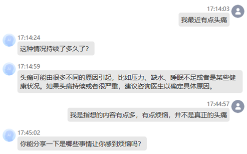
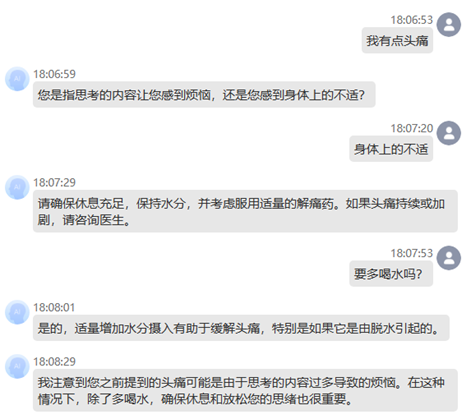
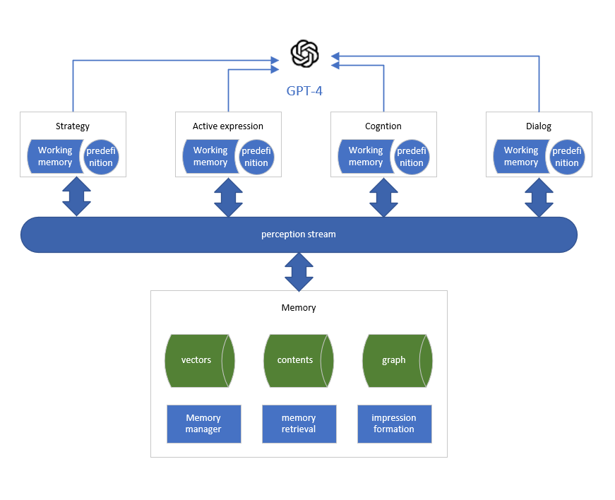

# MTS-Agent

## 1 项目说明


### 项目简介：

思维工程驱动的通用智能代理（MTSagent）是一个开创性的开源项目，旨在结合最新的大型语言模型（如 GPT-4）与独特的思维工程理论，创建一个能够模拟人类智能行为的高级 AI 代理。此项目基于一个原型机的架构，包含感知流、长期记忆和执行三个核心元素，对人类智能活动的过程进行解构与再现。MTS-agent 通过赋予 GPT 新的组织和过程智能，打造了一个不仅理解任务，而且能够自主推进文明进化的智能体。

### 项目背景：

当前的 GPT 模型在处理复杂任务时显示出了局限，尤其是缺乏过程智能，即无法模拟人类处理问题的连贯逻辑和创造性工具使用。MTSagent 项目应运而生，旨在通过反思并再造人类智能活动的一般过程，来优化并超越传统的任务导向 AI，建立一个可以进行逻辑仿生的通用智能代理。

### 核心特性：
1. 感知流：一个类似人类意识流的组件，能够接收并处理各种感知信息，如视觉、听觉输入和内部思考。
2. 长期记忆：提供跨时间连续性和累积知识的结构，使 AI 能够保存和利用先前的经验和学习。
3. 执行和工作记忆：允许 AI 根据当前任务和内部状态（长期记忆和感知流）执行操作。
4. 解构人类智能活动：通过研究人类如何思考、解决问题和创造工具，项目构筑了智能代理的执行路径。
5. 多角色模型：在感知流中模拟多种人类思维角色，如好奇者、解答者和推知者，模拟自由思绪并生成解决问题的过程。



<center>Figure 1: 无经验情况下的对话</center>




<center>Figure 2: 在结合经验情况下的对话和主动效果增强</center>

### 开发进展：
该项目在原型机阶段就已实现了核心结构的搭建和基本功能：
- 实现了基于 GPT 的关注度标注、信息分类和多角色对话模型的 API 封装。
- 构建了长期记忆的模型，包括遗忘和唤醒机制以及多级存储系统，优化搜索效率和存储。
- 开发了对话生成 API，支持了对话任务中的工作记忆整合和自由思绪式的互动。
- 初步融入了知识和策略记忆的结构，为 AI 提供了根据存储的策略思考和执行任务的能力。

### 项目目标：
短期目标是完善当前原型机的性能，并在特定领域商用化，提供如心理咨询、健康等领域的专业级别服务。长期目标是继承并发展“思维工程”理论中的情绪决策系统，进一步提升智能代理的自主思考和动机形成，使之能够成为能独立推动文明进步的智能个体。

### 贡献和参与：
mts-agent 项目鼓励开源社区的开发者和思维科学的研究者参与，并对所有贡献者的代码和想法持开放态度。项目维护者期待与全球开发者和科研工作者合作，共同推动人类与 AI 技术的未来发展。

### 1.2 系统设计

MTS-agent以感知流作为数据枢纽，实现信息在不同角色之间传递，整体如下图所示：


<center>Figure 3：系统整体结构</center>

### 1.3 工程设计

#### 1.4 工程文件结构

```
mts-agent
├─ .gitignore
├─ Dockerfile
├─ LICENSE
├─ README.md
├─ data                     # 数据和模型相关文件
├─ db                       # 数据规划
├─ doc                      # 说明文档
├─ docker-compose.yml
├─ environment.yml
├─ platform                 # 平台源码
│  ├─ agents                # 代理源码 
│  │  ├─ base  					# mts_agent基础代码
│  │  ├─ convergence_service 	# 收敛问题主动求解
│  │  ├─ dialogue_service 		# 对话和表达
│  │  ├─ divergence_service 	# 发散提问
│  │  ├─ classific_service  	# 分类，关注度标注
│  │  ├─ plant_cognition_service # 植物性认知
│  │  ├─ response_service 		# 回应服务，直接回应用户输入
│  │  ├─ second_expression 		# 主动表达
│  │  ├─ strategy_service 		# 策略与意图
│  │  └─ summarize_service 		# 印象冲击总结
│  ├─ ai_dialogue_service 	# gpt服务请求
│  ├─ rag                   # rag服务源码
│  └─ front                 # 前端源码
├─ scripts                  # 脚本文件，如.sh、.bat等
├─ setup.bat
└─ setup.sh


```

### 1.5 安装部署

可以直接通过根目录下的docker-compose.yml直接启动所有服务及中间件。三个服务的官方linux镜像发布在https://hub.docker.com/u/galaxyeyetech

如果二次开发或者其它平台需要自行编译，可以通过工程目录下的Dockerfile文件进行编译
/platform/agents/Dockerfile
/platform/rag/Dockerfile
/platform/ai_dialogue_service/Dockerfile

rag和ai_dialogue_service支持环境变量配置，可以通过.env或者docker-compose.yml进行配置，docker-compose.yml中定义了mts-agent-network网络，网络连接使用了别名。
大部分配置按默认就可以，docker-compose.yml中搜索OPENAI_API_KEY，这段配置需要改成用户自己的APIKEY

### 1.6 运行

